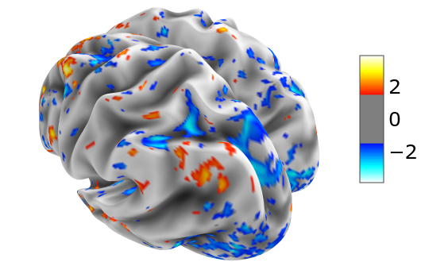
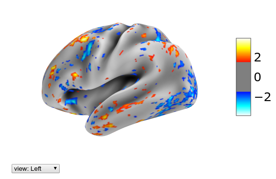
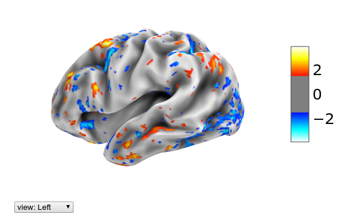
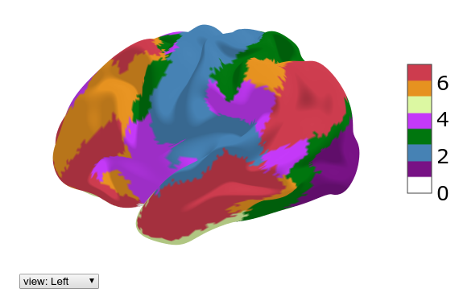
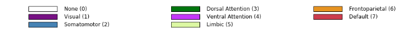
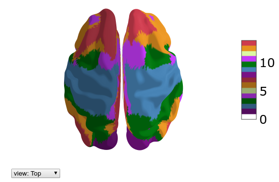
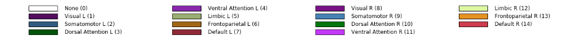
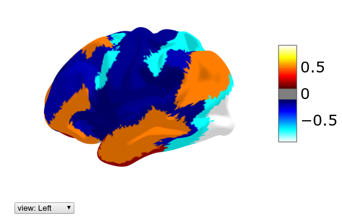
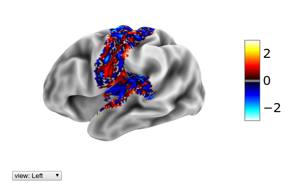
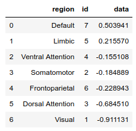

# Introduction

This package contains utilities to use  [Human Connectome Project](https://www.humanconnectome.org/) (HCP) data and HCP-like data (e.g. obtained from legacy data using [ciftify](https://github.com/edickie/ciftify)) as well as corresponding parcellations with [nilearn](https://nilearn.github.io/) and other Python tools. 

The HCP data differs from conventional volumetric fMRI data which records the BOLD signal from each *voxel* in a 3D volume in that the signal from the cortical surface is treated as a folded two dimensional surface, and hence the data is associated with vertices of a predefined surface mesh, while the subcortical structures are described volumetrically using voxels. 

The CIFTI (more precisely CIFTI-2) file format encompasses both the cortical 2D surface data as well as the subcortical volume data. However, only the voxels associated with relevant subcortical structures are kept.
Thus these data are quite richly structured. Although the standard Python tools for dealing with fMRI data like [nibabel](https://nipy.org/nibabel/) can read both the CIFTI-2 files containing the fMRI signals and the GIFTI files containing the surface mesh definitions, there is not much that one could do further out-of-the-box, in particular visualization using [nilearn](https://nilearn.github.io/) or processing parcellated data using e.g. machine learning tools which work with `numpy` arrays. The goal of this package is to ease the interoperability of HCP data and these standard Python tools.





The utilities mainly deal with plotting surface data, accessing the predefined subcortical structures as well as using various parcellations. Various helper functions aid e.g. in mapping the HCP fMRI cortical data to surface vertices for visualization etc. The functions work directly with numpy arrays of shape `Tx91282` or `91282` for fMRI data, with `T` being the number of time frames, while `91282` is the standard HCP dimensionality for the 3T cortical surface and subcortical data.


# Installation

Make sure that you have the following packages installed
```
nibabel, nilearn, numpy, scikit-learn, matplotlib, pandas
```
Then install with 
```
pip install hcp_utils   # TO BE IMPLEMENTED
```
upgrade with
```
pip install --upgrade hcp_utils
```


# Usage

Here we assume that the commands will be run in a Jupyter notebook as this allows for rotating and scaling the 3D plots with your mouse.

## Getting started

First import prerequisities.
```
import nibabel as nib
import nilearn.plotting as plotting
import numpy as np
import matplotlib.pyplot as plt
%matplotlib inline
```
Then import `hcp_utils`:
```
import hcp_utils as hcp
```

We use `nibabel` to load a CIFTI file with the fMRI time series. We also extract the fMRI time series to a `numpy` array.
```
img = nib.load('path/to/fMRI_data_file.dtseries.nii')
X = img.get_fdata()
X.shape     # e.g. (700, 91282)
```
which corresponds to 700 time-steps and 91282 grayordinates.

The CIFTI file format for HCP 3T data partitions the 91282 grayordinates into the left- and right- cortex as well as 19 subcortical regions. We can easily extract say the signal in the left hippocampus using `hcp.struct`

```
X_hipL = X[:, hcp.struct.hippocampus_left]
X_hipL.shape    # (700, 764)
```

The other available regions are
```
hcp.struct.keys()
```

> dict_keys(['cortex_left', 'cortex_right', 'cortex', 'subcortical', 'accumbens_left', 'accumbens_right', 'amygdala_left', 'amygdala_right', 'brainStem', 'caudate_left', 'caudate_right', 'cerebellum_left', 'cerebellum_right', 'diencephalon_left', 'diencephalon_right', 'hippocampus_left', 'hippocampus_right', 'pallidum_left', 'pallidum_right', 'putamen_left', 'putamen_right', 'thalamus_left', 'thalamus_right'])

For convenience we add a function which normalized the data so that each grayordinate has zero (temporal) mean and unit standard deviation:
```
Xn = hcp.normalize(X)
```

## Plotting

In order to plot the cortical surface data for the whole bran, one has to have the surface meshes appropriate for HCP data and combine the ones corresponding to the left and right hemispheres into a single mesh. 
In addition, the HCP fMRI data are defined on a *subset* of the surface vertices (29696 out of 32492 for the left cortex and 29716 out of 32492 for the right cortex). Hence we have to construct an auxilliary array of size 32492 or 64984 with the fMRI data points inserted in appropriate places and a constant (zero by default) elsewhere. This is achieved by the `cortex_data(arr, fill=0)`, `left_cortex_data(arr, fill=0)` and `right_cortex_data(arr, fill=0)` functions.

`hcp_utils` comes with preloaded surface meshes from the HCP S1200 group average data as well as the whole brain meshes composed of both the left and right meshes. In addition sulcal depth data is included for shading. These data are packaged in the following way:

```
hcp.mesh.keys()
```

> dict_keys(['white_left', 'white_right', 'white', 'midthickness_left', 'midthickness_right', 'midthickness', 'pial_left', 'pial_right', 'pial', 'inflated_left', 'inflated_right', 'inflated', 'very_inflated_left', 'very_inflated_right', 'very_inflated', 'flat_left', 'flat_right', 'flat', 'sphere_left', 'sphere_right', 'sphere', 'sulc', 'sulc_left', 'sulc_right'])

Here `white` is the top of white matter, `pial` is the surface of the brain, `midthickness` is halfway between them, while `inflated` and `very_inflated` may be better for visualization. `flat` is a 2D flat representation.

In order to make an interactive 3D surface plot using `nilearn` of the normalized fMRI data (thresholded at 1.5) at t=29 on the inflated group average mesh, we write

```
plotting.view_surf(hcp.mesh.inflated, hcp.cortex_data(Xn[29]), 
    threshold=1.5, bg_map=hcp.mesh.sulc)
```



The group average surfaces are much smoother than the ones for individual subjects. If we have those at our disposal we can load them and use them for visualization.

```
mesh_sub = hcp.load_surfaces(example_filename='path/to/fsaverage_LR32k/
    sub-XX.R.pial.32k_fs_LR.surf.gii')
```

Here as an argument we give just one example filename and `hcp_utils` will try to load all other versions for both hemispheres and the sulcal depth file assuming HCP like naming conventions (the `.R.pial` part here).
Let's look at the same data but now on the inflated single subject surface:

```
plotting.view_surf(mesh_sub.inflated, hcp.cortex_data(Xn[29]), 
    threshold=1.5, bg_map=mesh_sub.sulc)
```



## Parcellations

`hcp_utils` comes with a couple of parcellations preloaded. In particular we have the following ones (with the name of the variable with the parcellation data)

* the *Glasser et.al.* Multi-Modal Parcellation (MMP 1.0) which partitions each hemisphere of the cortex into 180 regions - `hcp.mmp`
* the Cole-Anticevic Brain-wide Network Partition (version 1.1) which 
    * extends the Multi-Modal Parcellation of the cortex by a parcellation of the subcortical regions - `hcp.ca_parcels`
    * groups the cortical (MMP) and subcortical regions into functional networks - `hcp.ca_network`
* the *Yeo et.al.* 7- and 17-region (cortical) functional networks - `hcp.yeo7` and `hcp.yeo17`
* the standard CIFTI partition into the main subcortical regions - `hcp.standard`

For references see the [github page](https://github.com/rmldj/hcp-utils). Please cite the relevant papers if you make use of these parcellations. These parcellations were extracted from the relevant `.dlabel.nii` files by the scripts in the `prepare/` folder of the package repository.

All the labels and the corresponding numerical ids for these parcellations are shown on the [parcellation labels](./parcellation_labels.html) page.

The data for a parcellation contained e.g. in `hcp.mmp` has the following fields:
* `parcellation.ids` - numerical ids of the parcels. 0 means unassigned.
* `parcellation.nontrivial_ids` - same but with the unassigned one omitted.
* `parcellation.labels` - a dictionary which maps numerical id to the name of the region
* `parcellation.map_all` - an integer array of size 91282, giving the id of each grayordinate
* `parcellation.rgba` - a dictionary which maps numerical id to the rgba color (extracted from the source files)

One can view a cortical parcellation on the 3D surface plot:

```
hcp.view_parcellation(mesh_sub.inflated, hcp.yeo7)
```



The color coding of the labels together with the numerical ids can be displayed through

```
hcp.parcellation_labels(hcp.yeo7)
```




Sometimes it may be convenient to differentiate between the networks in the left and right hemispheres. For that one can use the function `make_lr_parcellation(parcellation)` which takes a parcellation and separates the parcels in the left and right hemisphere. The subcortical part is set to zero (unassigned).

```
yeo7lr = hcp.make_lr_parcellation(hcp.yeo7)
hcp.view_parcellation(mesh_sub.inflated, yeo7lr)
```



```
hcp.parcellation_labels(yeo7lr)
```




The main point of a parcellation is to obtain the parcellated time series (by taking the mean over each parcel) for further analysis. This can be done through

```
Xp = hcp.parcellate(Xn, hcp.yeo7)
Xp.shape    # (700, 7)
```

One could e.g. take the maximum by writing instead
```
hcp.parcellate(Xn, hcp.yeo7, method=np.amax)
```
For visualization it might be interesting to plot the parcellated value on each location of the brain. For that we use the `unparcellate(Xp, parcellation)` function:

```
plotting.view_surf(mesh_sub.inflated, 
    hcp.cortex_data(hcp.unparcellate(Xp[29], hcp.yeo7)), 
    threshold=0.1, bg_map=mesh_sub.sulc)
```



If we wanted to focus just on the activity in the somatomotor network of Yeo-7, we can mask out to 0 the remaining parts of the brain using `mask(X, mask, fill=0)`. This is of course only useful for visualization:

```
plotting.view_surf(mesh_sub.inflated, 
    hcp.cortex_data(hcp.mask(Xn[29], hcp.yeo7.map_all==2)), 
    threshold=0.1, bg_map=mesh_sub.sulc)
```



Finally, once we have parcellated 1D data (e.g. a snapshot in time or the results of some analysis), we can order the regions according to the values using the function `ranking(Xp, parcellation, descending=True)`:

```
df = hcp.ranking(Xp[29], hcp.yeo7)
df
```



The above function returns a `Pandas` data frame which of course can be used for further analysis.


## External data and references

### Surface meshes

The default surface meshes for 3D visualization come from the group average of the Human Connectome Project (HCP) 1200 Subjects (S1200) data release (March 2017) processed using HCP pipelines. They can be obtained on BALSA: [https://balsa.wustl.edu/reference/show/pkXDZ](https://balsa.wustl.edu/reference/show/pkXDZ) 


These group average files are redistributed under the [HCP Open Access Data Use Terms](https://www.humanconnectome.org/study/hcp-young-adult/document/wu-minn-hcp-consortium-open-access-data-use-terms) with the acknowledgment: 

*"Data were provided [in part] by the Human Connectome Project, WU-Minn Consortium (Principal Investigators: David Van Essen and Kamil Ugurbil; 1U54MH091657) funded by the 16 NIH Institutes and Centers that support the NIH Blueprint for Neuroscience Research; and by the McDonnell Center for Systems Neuroscience at Washington University."*


### Parcellations

When using the included parcellations, please cite the relevant papers.

**The Glasser MMP1.0 Parcellation:** Glasser, Matthew F., Timothy S. Coalson, Emma C. Robinson, Carl D. Hacker, John Harwell, Essa Yacoub, Kamil Ugurbil, et al. 2016. “A Multi-Modal Parcellation of Human Cerebral Cortex.” Nature 536 (7615): 171–78.  [http://doi.org/10.1038/nature18933](http://doi.org/10.1038/nature18933) (see in particular the details in *Supplementary	Neuroanatomical	Results*).

**Yeo 7 or (17) Network Parcellation:** Yeo, B. T. Thomas, Fenna M. Krienen, Jorge Sepulcre, Mert R. Sabuncu, Danial Lashkari, Marisa Hollinshead, Joshua L. Roffman, et al. 2011. “The Organization of the Human Cerebral Cortex Estimated by Intrinsic Functional Connectivity.” Journal of Neurophysiology 106 (3): 1125–65. [https://doi.org/10.1152/jn.00338.2011](https://doi.org/10.1152/jn.00338.2011).

**The Cole-Anticevic Brain-wide Network Partition:** Ji JL*, Spronk M*, Kulkarni K, Repovs G, Anticevic A**, Cole MW** (2019). "Mapping the human brain's cortical-subcortical functional network organization". NeuroImage. 185:35–57. doi:10.1016/j.neuroimage.2018.10.006 [* = equal contribution; ** = senior authors] [https://doi.org/10.1016/j.neuroimage.2018.10.006](https://doi.org/10.1016/j.neuroimage.2018.10.006) (also available as an open access bioRxiv preprint: [http://doi.org/10.1101/206292](http://doi.org/10.1101/206292)) and [https://github.com/ColeLab/ColeAnticevicNetPartition/](https://github.com/ColeLab/ColeAnticevicNetPartition/)


* * *

*This package was initiated as a tool within the project ["Bio-inspired artificial neural networks"](http://bionn.matinf.uj.edu.pl/) funded by the Foundation for Polish Science (FNP).* 


