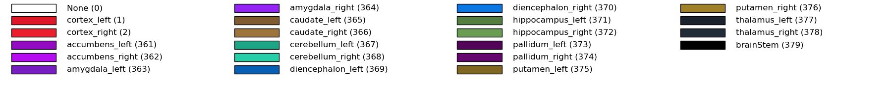
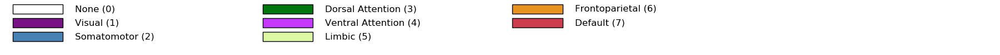
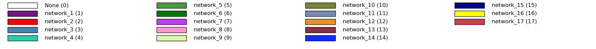
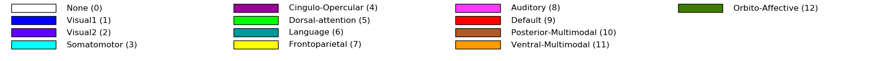
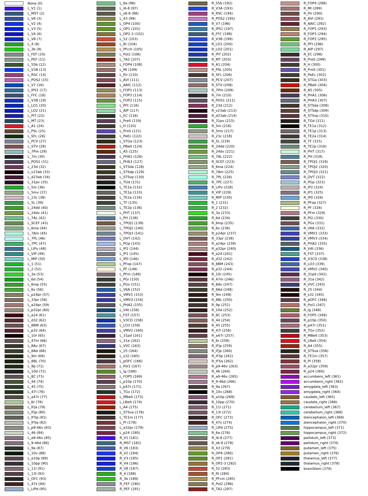
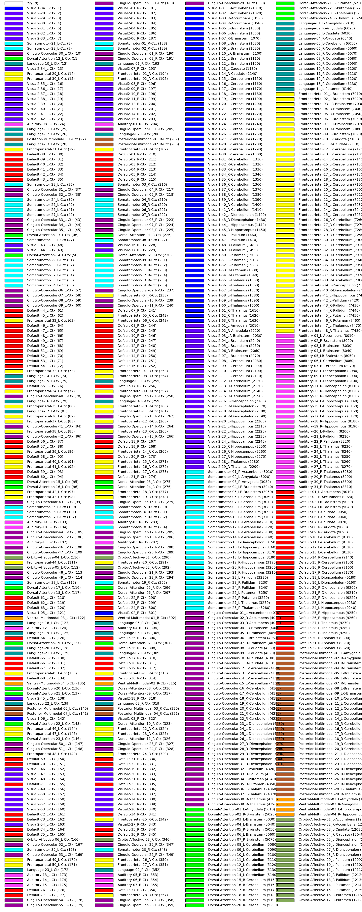

# Parcellation labels

Here we summarize the labels and the corresponding numerical ids of regions of the parcellations included in `hcp_utils`. We start with the smaller parcellations ending with the largest ones.

[Return to the main documentation](index.html)


### Standard CIFTI subcortical structures

```
hcp.parcellation_labels(hcp.standard)
```




### Yeo 7-region networks

```
hcp.parcellation_labels(hcp.yeo7)
```




### Yeo 17-region networks

```
hcp.parcellation_labels(hcp.yeo17)
```



### Cole-Anticevic brain-wide functional networks

These functional networks differ from the previous ones
* always contain whole cortical parcels from the MMP parcellation
* extend to the subcortical structures 

```
hcp.parcellation_labels(hcp.ca_network)
```




### Multi Modal Parcellation MMP

To the 360 cortical regions we added the standard subcortical structures (ids 361-379).
We exchanged the internal numerical ids between the left and right hemispheres for consistency with the Cole-Anticevic Brain-wide Network Partition. 

```
hcp.parcellation_labels(hcp.mmp)
```



### Cole-Anticevic extension of MMP to a parcellation of the subcortical regions

```
hcp.parcellation_labels(hcp.ca_parcels)
```




[Return to the main documentation](index.html)

